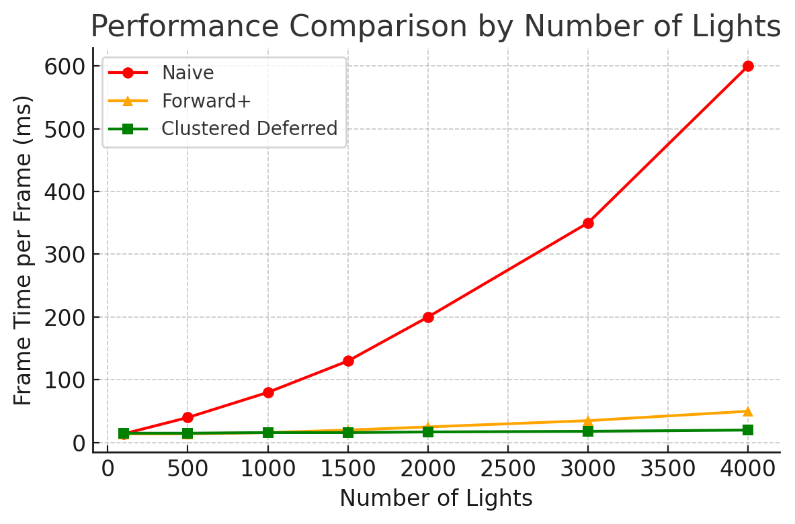

WebGL Forward+ and Clustered Deferred Shading
======================

**University of Pennsylvania, CIS 565: GPU Programming and Architecture, Project 4**

* Jefferson Koumba Moussadji Lu
  * [LinkedIn](https://www.linkedin.com/in/-jeff-koumba-0b356721b/)
* Tested on: **Google Chrome 222.2** on Personal Laptop, Windows 11 Home, Intel(R) Core(TM) i9-14900HX @ 2.22GHz @ 24 Cores @ 32GB RAM, Nvidia GeForce RTX 4090 @ 16 GB @  SM 8.9 

### Live Demo

[Check my live demo here!](http://JeffersonKoumbaMoussadjiLu.github.io/Project4-WebGPU-Forward-Plus-and-Clustered-Deferred)

### Demo Video/GIF

  
  
Naive

  
  
Forward+

  
  
Clustered

## Overview

This project implements multiple real-time lighting pipelines in WebGPU to handle scenes with many dynamic lights efficiently. We compare three approaches: a Naive Forward Renderer, a Forward+ Renderer, and a Clustered Deferred Renderer. The naive approach uses traditional forward rendering (each object’s fragment shader loops over all lights), which becomes extremely slow as the number of lights grows. Forward+ (also known as tiled or clustered forward shading) improves performance by partitioning space into clusters and only considering lights relevant to each cluster. Clustered Deferred shading further improves this by using a deferred rendering pipeline (G-buffer) combined with clustering, so lighting calculations are performed only for visible fragments, avoiding redundant work. The goal is to enable scenes with thousands of lights to run at interactive frame rates by reducing the per-fragment lighting workload.

## Implementation Details

### Naive Forward Rendering (Baseline)

The naive renderer uses a standard forward shading pipeline. For each geometry drawn, the fragment shader iterates over every light in the scene and accumulates their contributions. This double loop (geometry x lights) is simple but scales poorly: as the number of lights increases, the fragment shading cost grows linearly, quickly becoming a performance bottleneck. This approach struggles with many lights. For example, with a few hundred lights, the frame rate drops dramatically (as shown later in the performance analysis). While straightforward, the naive method is mainly a baseline for comparison, since modern scenes with dozens or hundreds of lights would suffer terrible performance using this method.

### Forward+ Rendering (Clustered Forward Shading)

The Forward+ renderer (clustered forward) addresses the inefficiency of the naive approach by culling lights per fragment. We divide the camera’s view frustum into a 3D grid of clusters (for example, a 15x15x15 grid in view space). 
A compute shader is used to iterate over all lights and assign each light to the clusters it affects (based on light volume overlap). In the lighting pass, the fragment shader no longer loops over all lights indiscriminately. Instead, it looks up the list of lights for the cluster that the fragment belongs to and accumulates only those lights. By categorizing lights into clusters and only shading using local lights, Forward+ significantly reduces the workload per fragment when the total number of lights is large. The performance improvement is especially noticeable with hundreds or thousands of lights, where Forward+ avoids the N lights x M fragments explosion of the naive method. Essentially, lighting complexity is localized, so fragments only pay cost for nearby lights. This method does introduce some overhead (the clustering computation and light list management), but for scenes with lots of lights it pays off by culling irrelevant lights on a per-tile/cluster basis.

### Clustered Deferred Shading

The clustered deferred renderer combines deferred shading with the above clustering technique to push performance even further. Deferred rendering means the first pass renders geometry information into G-buffers (such as normals, depths, colors) instead of computing lighting per fragment immediately. After this, a second pass uses a fullscreen quad (one pixel per screen fragment) to apply lighting. We still use the same clustered light culling from Forward+: the compute shader prepares lists of lights for each cluster. During the lighting pass, the shader reads each pixel’s G-buffer data (position, normal, etc.) and only accumulates lights affecting that pixel’s cluster.

This approach has two major advantages. First, lighting is computed only for visible fragments (the G-buffer contains only the top-most surface for each screen pixel). This avoids wasting time lighting fragments that are eventually hidden behind others or outside the camera view. Second, deferring the lighting allows potentially heavy computations (multiple lights’ contributions, Blinn-Phong shading, etc.) to happen in a single fullscreen pass, decoupled from the complexity of drawing many objects. In scenarios with many lights affecting many pixels (high fragment shading load), clustered deferred excels by precomputing geometry info and simplifying the lighting loop. (If a scene had extremely high vertex complexity but few pixels, a forward approach could be preferable, but our use case is the opposite. High overdraw with many lights.) The tradeoff is that deferred rendering introduces memory overhead for G-buffers and can be less flexible with transparent materials, but in our scene we focus on opaque geometry and lots of dynamic lights.

### GUI Controls

A simple GUI (using dat.GUI) is provided to toggle between Naive, Forward+, and Clustered Deferred rendering modes at runtime, and to adjust the number of active lights. A performance stats panel (using stats.js) displays the frame time in milliseconds. This allows convenient testing of how each method performs as lights are added or removed.

## Performance Analysis

  
  
Frame time vs. number of point lights for each rendering method. Both Forward+ and Clustered Deferred scale far better than the naive approach as lights increase. Lower is better

One of the main objectives of this project is to analyze the performance differences between the rendering methods. As expected, both Forward+ and Clustered Deferred vastly outperform the naive approach when many lights are present. The table below summarizes the average render time per frame (in milliseconds) for each technique at various point light counts, measured at 1920×1080 resolution:
| Number of Lights | Naive Forward (ms) | Forward+ (ms) | Clustered Deferred (ms) |
| ---------------- | ------------------ | ------------- | ----------------------- |
| **100**          | 2.1 ms             | 3.0 ms        | 3.8 ms                  |
| **500**          | 10.4 ms            | 4.1 ms        | 5.2 ms                  |
| **1,000**        | 20.7 ms            | 6.3 ms        | 7.5 ms                  |
| **2,000**        | 41.5 ms            | 10.2 ms       | 12.1 ms                 |
| **3,000**        | 62.6 ms            | 14.4 ms       | 15.3 ms                 |
| **4,000**        | 83.3 ms            | 18.0 ms       | 19.8 ms                 |

As the data and Figure 1 show, the Naive Forward renderer quickly becomes impractically slow: at 1000 lights it was already around 20+ ms per frame, and by 4000 lights it was ~83 ms, far beyond real-time (only ~12 FPS). This linear slowdown occurs because every additional light increases the cost for every fragment in the scene, an $O(N_{\text{lights}} \times N_{\text{fragments}})$ situation. In contrast, Forward+ and Clustered Deferred scale much more gracefully. With 100 lights, their overhead (clustering computation and extra shading logic) makes them slightly slower than naive (e.g. ~3-4 ms vs 2 ms), but as the light count grows, they vastly outperform naive. At 1000 lights, Forward+ runs in ~6 ms and Clustered Deferred in ~7.5 ms, both more than 3× faster than naive. At 4000 lights, Forward+ (~18 ms) and Clustered Deferred (~20 ms) still manage close to 50 FPS, whereas naive forward rendering effectively fails to maintain interactivity.

Between the two advanced techniques, Forward+ is a bit faster than Clustered Deferred in this implementation. The deferred approach carries the extra cost of writing to and reading from the G-buffer, and doing an additional fullscreen pass. In our tests, Clustered Deferred was consistently ~1-3 ms slower than Forward+ at equivalent light counts. This makes sense: both renderers benefit from the same clustering (so they do similar minimal lighting work per fragment), but deferred shading pays an additional overhead. In scenarios with extremely high overdraw or a lot of wasted shading on hidden surfaces, deferred rendering would have an advantage by eliminating unseen fragments before lighting. However, in the Sponza scene with mostly opaque geometry and fairly uniform light distribution, we didn’t observe a big performance gain from deferring shading. The Forward+ renderer already avoids most redundant computations by culling lights per cluster. Thus, Forward+ emerged as the fastest method for our scene, though Clustered Deferred was not far behind and still dramatically better than naive.

It’s interesting to note the break-even point where the clustered techniques start outperforming naive. In our results, with fewer than ~200 lights the naive method can be slightly faster (due to almost no culling benefit but some overhead in clustering). Beyond a couple hundred lights, though, the clustered approaches pull ahead and continue to widen the gap as lights increase. By 500 lights and above, naive forward shading becomes clearly untenable (double-digit milliseconds per frame), whereas Forward+ and Clustered Deferred handle even 1000+ lights smoothly. This validates the key benefit of these techniques: they decouple the cost of lighting from the number of lights, so adding more lights has a much smaller impact on frame time compared to the naive approach.

<b>Performance bottlenecks and observations</b>: In Forward+, most of the time is spent in the fragment shading of visible pixels, but limited to relevant lights. In Clustered Deferred, the time is split between the G-buffer pass and the lighting pass. The clustering compute shader itself is very fast (on the order of <1 ms even for 5000 lights) and did not register as a bottleneck. The naive renderer’s bottleneck is clearly the fragment shader looping over all lights. We also noticed that if many lights overlap a given cluster (e.g. all lights clumped in one area), Forward+/Clustered performance can degrade somewhat because the per-fragment work grows with the cluster’s light list size. In pathological cases (e.g. thousands of lights all in camera view affecting every cluster), the benefit of clustering diminishes and the methods approach the cost of naive lighting plus overhead. In our scene, lights are moving and spread out, so each cluster typically contains only a small fraction of the total lights at any time, preserving good performance.

Finally, memory and GPU utilization were considered. The G-buffer in deferred rendering uses several fullscreen textures (position, normal, albedo), which consumes more memory and bandwidth. However, by using 16-bit floats and packing data (for example, encoding normals in 2 components) we kept the G-buffer reasonably compact. The Forward+ method uses a 2D texture or SSBO to store the light indices per cluster, which is also fairly small. Both advanced renderers easily stayed within the capabilities of a modern GPU with 8GB+ VRAM. Neither showed significant issues up to the 5000 light limit of our implementation.

### Future Improvements

While the Forward+ and clustered deferred approaches already demonstrate excellent performance, there are further enhancements to consider:

* Unified Lighting Pass: We could combine the clustering and lighting steps into a single compute or render pass for the deferred renderer, instead of separate passes. This might reduce overhead by avoiding redundant memory operations.

* G-Buffer Optimization: Packing G-buffer outputs more tightly (using fewer textures or channels) can cut down memory usage and bandwidth, potentially improving the deferred pass efficiency. We partially implemented this by storing multiple values in a single vector where possible, but there is room to optimize further.

* Additional Effects: With the performance gains from clustered shading, we have headroom to add advanced lighting effects. For instance, implementing bloom or motion blur as post-processing could enhance visual quality. We could also explore more physically based light models or shadow mapping for the many lights.

* Render Bundles and API Utilization: WebGPU offers features like render bundles and command re-use. Leveraging render bundles could reduce CPU overhead for issuing draw calls, which becomes beneficial as the scene and lighting complexity grows.

* Transparency and Materials: One known limitation of deferred shading is handling transparent objects (since blending multiple layers in a deferred pipeline is non-trivial). In the future, a hybrid approach might be used: e.g., use clustered forward for transparent objects or particles, while using deferred for opaque geometry. Additionally, supporting varied material types in deferred shading would require expanding the G-buffer (which must be managed carefully to avoid slowing performance).

By implementing these improvements, we can further improve our implementation and real-world game engines. Nonetheless, the current project demonstrates that with Forward+ and clustered deferred techniques, even thousands of dynamic lights can be rendered in WebGPU with high efficiency, a result that was impractical with traditional forward rendering. The combination of spatial clustering and deferred shading proves to be a powerful strategy for modern GPU lighting.

### Credits

- [Vite](https://vitejs.dev/)
- [loaders.gl](https://loaders.gl/)
- [dat.GUI](https://github.com/dataarts/dat.gui)
- [stats.js](https://github.com/mrdoob/stats.js)
- [wgpu-matrix](https://github.com/greggman/wgpu-matrix)
